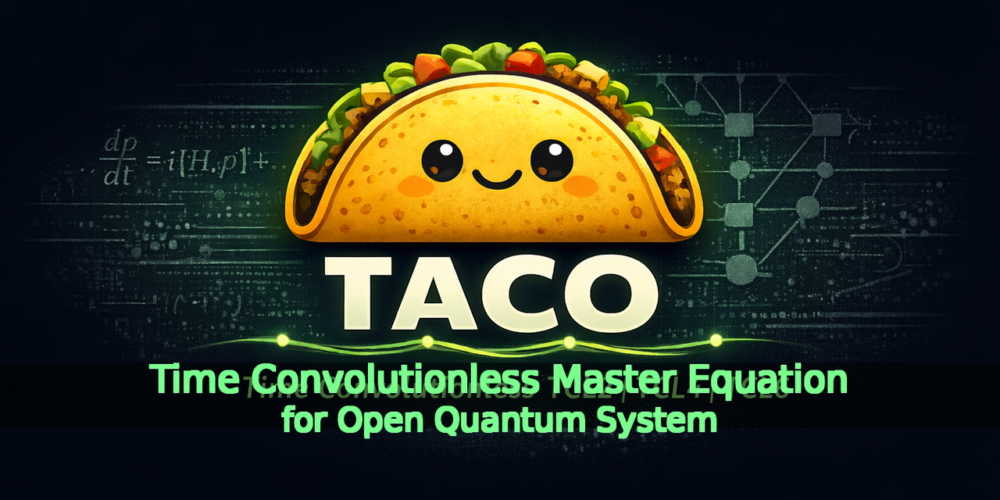

<p align="center">
  
</p>

# TACO - TCL-Accelerated Compute Orchestrator
TCL = **Time-Convolutionless** master-equation solvers.

TACO is a fast, parallel, scalable time-convolutionless (TCL) runtime with a C++ backend and Python interface for open-quantum-system dynamics. It also includes a standalone MATLAB reference implementation. TACO currently supports single-node parallelism via OpenMP and CUDA; multi-node support is under development.

## Features
- Backends:
  C++(serial, openmp, cuda) with Python as frontend. Matlab: standalone. 
- TCL2 generator + Liouvillian builders
- TCL4 kernels and assembly in seconds
- Higher-order TCL (TCL6/TCL2n) under development.

## Install
### Python package (recommended)
From source (CPU-only):
- `CMAKE_ARGS="-DTACO_BUILD_PYTHON=ON" pip install .`

From source (CUDA):
- `CMAKE_ARGS="-DTACO_BUILD_CUDA=ON -DTACO_BUILD_PYTHON=ON -DCMAKE_CUDA_ARCHITECTURES=native" pip install .`

### C++ only (no Python)
- Configure: `cmake -S . -B build`
- Build (Release): `cmake --build build --config Release`

## Quickstart
```python
import numpy as np
import taco

H = np.array([[0.0, 0.5], [0.5, 0.0]], dtype=np.complex128)
A = np.array([[0.5, 0.0], [0.0, -0.5]], dtype=np.complex128)
rho0 = np.array([[1.0, 0.0], [0.0, 0.0]], dtype=np.complex128)

omega = np.linspace(0.0, 20.0, 256, dtype=np.float64)
J = omega * np.exp(-omega / 5.0)

bath = taco.tcl.BathTabulated(temperature=2.0, omega=omega, J=J, bcf_end_time=1.0)
cfg = taco.tcl.SimConfig(dt=1e-2, t_end=1.0, save_stride=1, order=4)
# (equivalently: cfg = taco.tcl.SimConfig(dt=1e-2, n_steps=100, save_stride=1, order=4))

res = taco.tcl.simulate(H, A, bath, cfg, rho0, device="cpu")  # or device="cuda"
# For CUDA FP32 kernels: taco.tcl.simulate(..., device="cuda", precision="fp32")
print(res.t.shape, res.rho.shape)
```

For a detailed end-to-end example (spin-boson model + bath + parameters + plots + E2E benchmark), open:
- `python/examples/tcl4_e2e_cuda_compare.ipynb`

MATLAB code lives in:
- `matlab/README.md`

## Build from source (C++)
- Enable MPI (distributed CPU): `-DTACO_WITH_MPI=ON` (requires MPI)
- Enable Python extension: `-DTACO_BUILD_PYTHON=ON` (default OFF; add `-DPython_EXECUTABLE=...` if needed)
- Disable C++ tests/tools: `-DTACO_BUILD_TESTS=OFF`
- Disable C++ examples: `-DTACO_BUILD_EXAMPLES=OFF`
- Disable C++ benchmarks: `-DTACO_BUILD_BENCHMARKS=OFF`
- Disable gamma tests: `-DTACO_BUILD_GAMMA_TESTS=OFF`

## CUDA backend (C++, performance-focused)
- Build: `cmake -S . -B build-cuda -DTACO_WITH_CUDA=ON` then `cmake --build build-cuda --config Release`
- Implementation highlights:
  - F/C/R construction uses cuFFT + CUB scans (`compute_triple_kernels_cuda`).
  - Fused end-to-end L4 builders keep intermediates on device and copy L4 back in one transfer:
    - `build_TCL4_generator_cuda_fused(...)` (single time index)
    - `build_TCL4_generator_cuda_fused_batch(...)` (multiple time indices)
  - Dense RK4 propagation on GPU (for small dense systems):
    - API: `taco/backend/cuda/rk4_dense_cuda.hpp` (`taco::tcl::rk4_update_cuda`)
    - Matvec backends: `Rk4DenseCudaMethod::WarpKernel` (default) or `Rk4DenseCudaMethod::CublasGemv` (cuBLAS `cublasZgemv`)
    - Smoke test: `rk4_dense_cuda_smoke` (`tests/rk4_dense_cuda_smoke.cu`)
  - CUDA Graphs can capture/replay the fixed MIKX -> GW -> L4 launch sequence to reduce host launch overhead:
    - Disable with `TCL4_USE_CUDA_GRAPH=0`
    - Diagnostics with `TCL4_CUDA_GRAPH_VERBOSE=1`
- CPU vs CUDA compare tool: `tcl4_e2e_cuda_compare`
  - Build: `cmake --build build-cuda --config Release --target tcl4_e2e_cuda_compare`
  - Run (PowerShell): `.\build-cuda\Release\tcl4_e2e_cuda_compare.exe --N=200000 --tidx=0:1:10000 --gpu_warmup=1 --threads=8 --rk4_method=warp`
  - Try cuBLAS RK4: add `--rk4_method=cublas` (usually slower for very small D due to overhead)
- More details: `cpp/src/backend/cuda/README.md`

## MPI + OpenMP (CPU over distributed memory system, experimental)
- C++ API: `taco/backend/cpu/tcl4_mpi_omp.hpp` (`build_TCL4_generator_cpu_mpi_omp_batch`).
- Rank 0 returns the gathered `L4(t)` vector; non-root ranks return `{}`.

## Python bindings
- Build/install commands are listed in **Install**.
- Tests: `pytest -q`
- Repo-checkout usage (no install): `python -c "import sys; sys.path.insert(0,'python'); import taco; print(taco.version())"`
- Jupyter/VS Code: open `python/examples/tcl4_e2e_cuda_compare.ipynb` (kernel Python must match the built `taco/_taco*.pyd` ABI tag).
- Note: when built with CUDA, `taco.tcl.simulate(..., device="cuda")` uses the existing CUDA L4 builder (order=4) and CUDA RK4 for propagation; inputs/outputs are host NumPy arrays (host<->device copies happen internally).
- Optional: `precision="fp32"` selects the FP32 CUDA kernels (casts on upload/download; outputs remain `complex128`).
- E2E benchmark helper: `taco.tcl.e2e_cuda_compare_spin_boson(...)` (mirrors `tcl4_e2e_cuda_compare`); notebook: `python/examples/tcl4_e2e_cuda_compare.ipynb`
- More details (including RK4 wiring + building for a specific notebook/kernel Python): `python/README.md`

## Repo hygiene

- Clean ignored build/test artifacts: `powershell -NoProfile -ExecutionPolicy Bypass -File scripts/dev.ps1 -Action clean`
- Test artifacts (logs + copied `*_test_results.txt`) are written under `out/tests/...` by `scripts/run_tests.ps1`.

## What is required vs optional

Required for a usable TACO checkout:
- `CMakeLists.txt`, `cpp/`, `configs/`, `scripts/`
- `pyproject.toml`, `python/taco/`, `python/tests/` (for Python package + validation)

Optional (safe to exclude from a lean shipment if you do not need them):
- `matlab/` (reference/prototyping implementation)
- `generator_simplification.py` (symbolic research helper)
- `DEV_GUIDE.md`, `DEV_LOG.md`, `docs/*_PLAN.md` (developer planning/history docs)
- `tests/tcl_test.h5` (large HDF5 fixture used by optional `tcl4_h5_compare`)

## TCL4 Demo & Test
- Demo driver: `tcl_driver` loads a YAML config (matrix `H`, `A` and `J_expr`) and runs TCL4 assembly
  - Build: `cmake --build build --config Release --target tcl_driver` (requires `yaml-cpp`)
  - Run (Win): `build\Release\tcl_driver.exe --config=configs\tcl_driver.yaml`
- Test: `tcl4_tests` compares Direct vs Convolution F/C/R
  - Build: `cmake --build build --config Release --target tcl4_tests`
  - Run: `build\Release\tcl4_tests.exe`
- Test (MPI, optional): `tcl4_mpi_omp_tests`
  - Build: `cmake --build build --config Release --target tcl4_mpi_omp_tests`
  - Run: `mpiexec -n 4 build\Release\tcl4_mpi_omp_tests.exe`

## License

MIT, see `LICENSE`.
